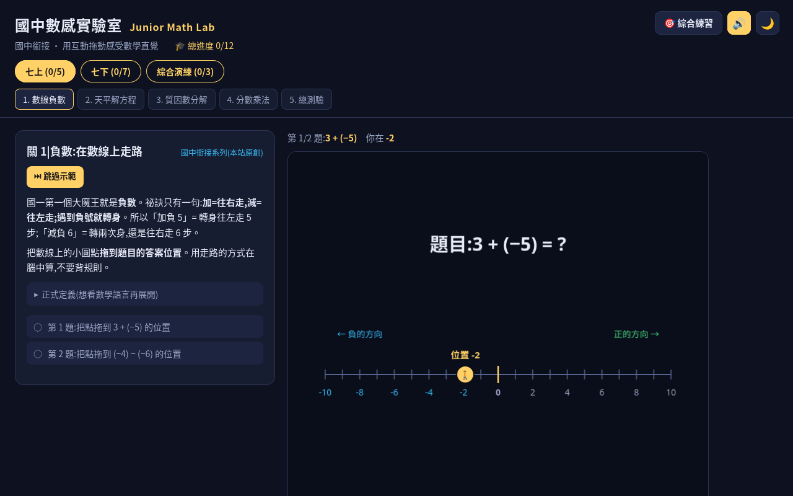

# 國中數感實驗室 Junior Math Lab

**Live: https://junior-math-lab.vercel.app**



108 課綱七年級互動數學練習站。12 個關卡(七上 / 七下兩冊),用拖動、點選直接感受數學直覺。

純前端、零依賴(Canvas 2D + vanilla JS),開 `index.html` 即用;進度存 localStorage。
> **注意**:進度與錯題本存在本機瀏覽器,清除快取會消失;換裝置不同步。

## 關卡一覽

### 七上

| 關 | 主題 | 對應課綱單元 |
|---|---|---|
| J1 | 數線負數 | 數與數線(正負數) |
| J2 | 天平解方程 | 一元一次方程式 |
| J5 | 質因數分解 | 因數倍數與分數運算 |
| J6 | 分數乘法 | 因數倍數與分數運算 |
| B1Q | 七上總測驗 | — |

### 七下

| 關 | 主題 | 對應課綱單元 |
|---|---|---|
| J3 | 座標尋寶 | 直角座標與方程式圖形 |
| J4 | 比與比例 | 比例(比例式/正反比) |
| J7 | 交點獵人 | 二元一次聯立方程式 |
| J8 | 數線塗色 | 一元一次不等式 |
| J9 | 數據偵探 | 統計圖表與數據 |
| J10 | 鏡子與積木 | 線對稱與三視圖 |
| JQ | 七下銜接總測驗 | — |

## 特色

- 每關配**自動示範動畫**(首次進入自動播,可重播)
- 示範附**語音旁白**(Kokoro zf_xiaoxiao 中文,預錄 mp3)
- 每冊結尾有**總測驗**,答錯自動加入**錯題複習本**
- 深色 / 淺色主題切換(localStorage 記住)

## 課程總綱

詳見 [SYLLABUS.md](SYLLABUS.md),含 108 課綱單元對照與後續批次規劃。

## 本機開發

```bash
python3 -m http.server 8123   # 然後開 http://localhost:8123/
```

測試:

```bash
cd tests && python3 test_wrongbook.py
cd tests && python3 test_batch1_final.py
cd tests && python3 test_voice_default.py
```

旁白重生:`tools/kokoro-venv/bin/python tools/gen_narration.py`(需 misaki[zh])。

## 版權

MIT — 內容原創,非官方,與 JOHNSON-MATH 頻道無隸屬關係。
